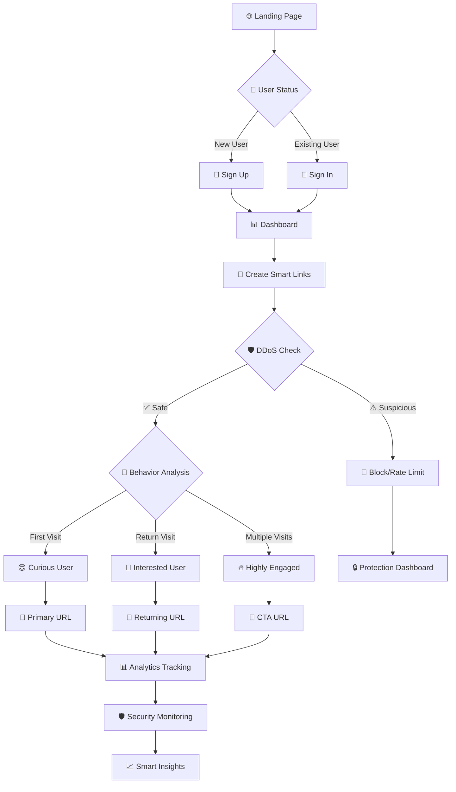
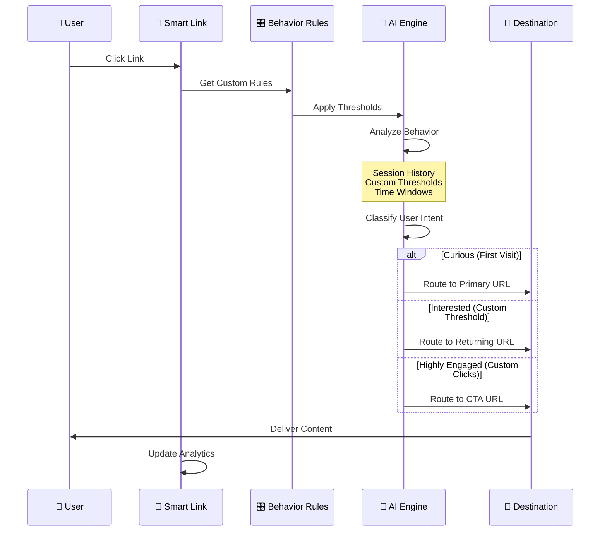

# 🔗 Smart Link Intelligence Platform

<div align="center">


**🚀 Next-Generation Behavior-Aware Link Shortener with Advanced Analytics**

*Transform simple links into intelligent, adaptive experiences that learn from user behavior*

[🎯 Features](#-features) • [🛠️ Installation](#️-installation) • [📊 Analytics](#-analytics) • [🔧 API](#-api) • [🎨 Screenshots](#-screenshots)

</div>

---

## 🌟 What Makes It Special?

Smart Link Intelligence isn't just another URL shortener. It's an **intelligent routing system** that adapts to user behavior, provides deep analytics, and maximizes engagement through smart decision-making.

### 🎨 **Professional Landing Experience**
- **Modern Landing Page**: Beautiful, responsive landing page with professional design
- **Gradient Aesthetics**: Purple-to-blue gradient theme with glass morphism effects
- **Interactive Elements**: Smooth animations, hover effects, and engaging user interface
- **Clear Value Proposition**: Immediately showcases platform capabilities and benefits



---

## ✨ Features

### 🎯 **Smart Routing Engine**
- **Behavior-Based Routing**: Automatically routes users based on engagement level
- **Progressive Journeys**: Guide users through custom conversion funnels
- **Custom Behavior Rules**: Define your own thresholds for visitor classification
- **Geographic Intelligence**: Region-based analytics and routing

### 🧠 **Intelligent Behavior System**
- **Flexible Thresholds**: Set custom visit and click counts for behavior classification
- **Multiple Rule Sets**: Create different rules for different use cases
- **Real-Time Classification**: Dynamic visitor behavior analysis
- **Rule Management**: Easy-to-use interface for creating and managing behavior rules

### 🛡️ **Advanced Security & Protection**
- **Multi-Layer DDoS Protection**: Automatic detection and mitigation of distributed attacks
- **Rate Limiting**: Intelligent request throttling per IP and link
- **Burst Attack Prevention**: Real-time detection of rapid-fire requests
- **Automatic Link Protection**: Self-healing links that disable under attack
- **Security Dashboard**: Monitor threats and manage protection levels

### 🤖 **AI-Powered Support**
- **Smart Chatbot**: Integrated AI assistant to help users navigate the platform
- **Automated Assistance**: Quick answers for common queries and troubleshooting

### ⚡ **System Control**
- **Comprehensive Admin Panel**: Full administrative control system to manage users, ads, and platform health.
- **Centralized Management**: Unified interface for system-wide configuration and monitoring.

### 🎨 **Professional User Experience**
- **Stunning Landing Page**: Modern, responsive design with gradient aesthetics and glass morphism
- **Intuitive Navigation**: Clear user journey from landing to dashboard
- **Interactive Elements**: Smooth animations, hover effects, and engaging UI components
- **Mobile-First Design**: Optimized for all devices and screen sizes
- **Smart Ad System**: Unified ad platform supporting both user-created and system-wide advertisements.
- **Custom Branding**: Personalized ad creation with image support
- **Premium Features**: Ad-free experience and advanced analytics for Elite Pro users
- **Link Management**: Delete, track, and manage all links from one dashboard
- **Export Capabilities**: Excel/CSV export with shareable analytics

---

## 🛠️ Installation

### 📋 Prerequisites
- Python 3.8+ 🐍
- pip package manager 📦
- Modern web browser 🌐

### ⚡ Quick Start

```bash
# 1️⃣ Clone the repository
git clone https://github.com/yourusername/smart-link-intelligence.git
cd smart-link-intelligence

# 2️⃣ Create virtual environment
python -m venv .venv

# 3️⃣ Activate virtual environment
# Windows
.venv\Scripts\activate
# macOS/Linux
source .venv/bin/activate

# 4️⃣ Install dependencies
pip install -r requirements.txt

# 5️⃣ Launch the application
python app.py
```

🎉 **That's it!** Visit `http://localhost:5000` to see the beautiful landing page and start using Smart Link Intelligence.

### 🔧 Configuration

Create a `.env` file for custom configuration:

```env
# Flask Configuration
FLASK_SECRET=your-super-secret-key-here
FLASK_ENV=development

# Database Configuration
DATABASE_URL=sqlite:///smart_links.db

# Analytics Configuration
ANALYTICS_RETENTION_DAYS=90
MAX_LINKS_PER_USER=100
```

### 🏗️ Application Structure

The application follows a clean routing structure:

```
🌐 Routes & Navigation Flow:

┌─ / (Root)
│  ├─ 👤 Not Logged In → Landing Page
│  └─ 🔐 Logged In → Redirect to Dashboard
│
├─ /login → Sign In Page
├─ /signup → Sign Up Page  
├─ /dashboard → Main Dashboard (requires auth)
├─ /r/<code> → Smart Link Redirect
├─ /ads/<code> → Ad Display Page
├─ /analytics-overview → Analytics Dashboard
├─ /behavior-rules → Custom Rules Management
├─ /ddos-protection → Security Dashboard
└─ /create-ad → Ad Creation Interface
```

**🎯 User Flow:**
1. **First Visit** → Beautiful landing page with clear CTAs
2. **Sign Up/In** → Secure authentication system  
3. **Dashboard** → Link creation and management interface
4. **Analytics** → Comprehensive tracking and insights
5. **Security** → DDoS protection and threat monitoring

---

## 📊 How It Works

### 🧠 Intelligent Behavior Classification



### 🎛️ Custom Behavior Rules

Configure your own thresholds for visitor classification:

```
🎯 E-commerce Rule:
- Returning Window: 72 hours
- Interested: 3+ visits
- Engaged: 5+ clicks

📚 Blog Rule:
- Returning Window: 24 hours  
- Interested: 2+ visits
- Engaged: 3+ clicks
```

---

## 🎨 Screenshots

### 🌐 Landing Page Experience
```
┌─────────────────────────────────────────────────────────────┐
│ 🌟 Smart Link Intelligence - Landing Page                  │
├─────────────────────────────────────────────────────────────┤
│                                                             │
│  🎨 Modern Gradient Header with Glass Morphism             │
│  ┌─────────────────────────────────────────────────────────┐ │
│  │ Smart Link Intelligence    [Sign In] [Sign Up]         │ │
│  └─────────────────────────────────────────────────────────┘ │
│                                                             │
│  🚀 Hero Section                                           │
│  ┌─────────────────────────────────────────────────────────┐ │
│  │ Create, Manage & Optimize Smart Links with Ease        │ │
│  │                                                         │ │
│  │ A powerful, secure, and intelligent platform to        │ │
│  │ create behavior-aware links with advanced analytics,    │ │
│  │ DDoS protection, and AI-powered routing.               │ │
│  │                                                         │ │
│  │ [🚀 Sign Up]  [▶️ How It Works]                        │ │
│  └─────────────────────────────────────────────────────────┘ │
│                                                             │
└─────────────────────────────────────────────────────────────┘
```

---

## 🔧 API Reference

### 🔗 Link Management

#### Create Smart Link
```http
POST /api/links
Content-Type: application/json

{
  "primary_url": "https://example.com",
  "returning_url": "https://example.com/returning",
  "cta_url": "https://example.com/signup",
  "behavior_rule": "progression",
  "behavior_rule_id": 123,
  "custom_code": "my-link"
}
```

---

## 🔒 Security & Privacy

### 🛡️ **Multi-Layer DDoS Protection**

Smart Link Intelligence features enterprise-grade DDoS protection:

```
🔄 Protection Workflow:

1. 📊 Request Analysis
   ├── IP-based rate limiting
   ├── Burst detection
   └── Behavioral analysis

2. 🎯 Threat Classification
   ├── Level 1-2: Enhanced monitoring
   ├── Level 3: Captcha verification
   ├── Level 4: Temporary disable
   └── Level 5: Manual recovery required

3. 🛡️ Automatic Response
   ├── Real-time blocking
   ├── Link protection activation
   └── Event logging & analytics
```

---

## 📄 License

This project is licensed under the MIT License - see the [LICENSE](LICENSE) file for details.

---

<div align="center">

**🚀 Ready to make your links smarter?**

[🌐 Visit Landing Page](http://localhost:5000) • [🎯 Sign Up](http://localhost:5000/signup) • [🔐 Sign In](http://localhost:5000/login) • [📊 Dashboard](http://localhost:5000/dashboard)

---

*Made with ❤️ by the Smart Link Intelligence Team*


</div>
